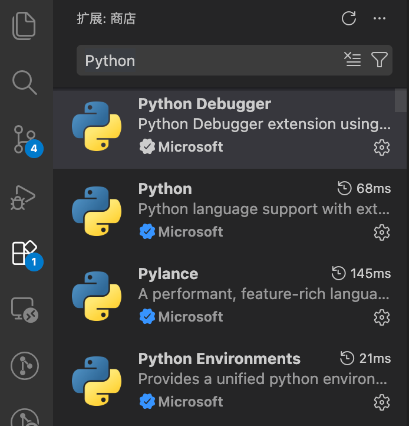
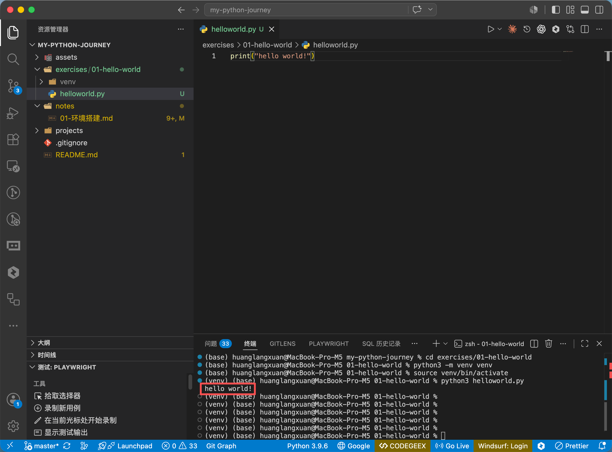
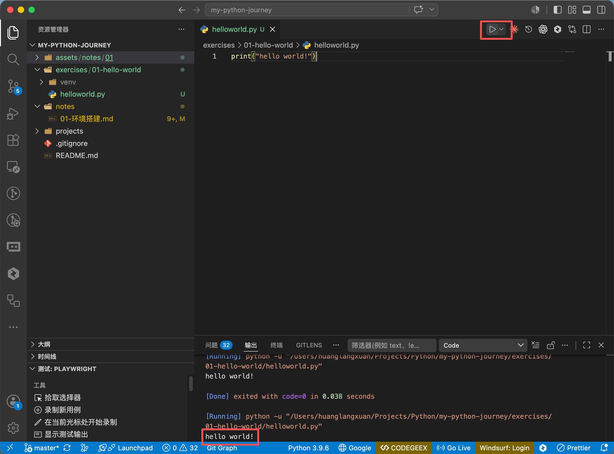

# 01-环境搭建

> 本文MacOS Apple Silicon为例。


## 一、前置准备


### （一）安装Homebrew

> Homebrew官网：[https://brew.sh](https://brew.sh)

1. 在终端中输入以下命令进行安装：
```bash
/bin/bash -c "$(curl -fsSL https://raw.githubusercontent.com/Homebrew/install/HEAD/install.sh)"
```

2. 在终端中执行以下命令配置环境变量，并使环境变量生效：
```bash
export PATH="/opt/homebrew/bin:$PATH"
source ~/.zshrc
```


### （二）安装Xcode Command Line Tools

在终端中输入以下命令进行安装：
```bash
xcode-select --install
```

需要同意下许可协议。

安装成功后，运行下命令进行验证：

```bash
xcode-select -p
```


## 二、安装Python
1. 先在终端中运行以下命令更新`Homebrew`软件包索引：
```bash
brew update
```

2. 运行以下命令安装`Python`稳定版：
```bash
brew install python
```

3. 运行以下命令验证`Python`是否安装成功，输出`/opt/homebrew/bin/python3`符合预期。
```bash
which python3
```

接着运行以下命令，显示版本号说明安装成功。
```bash
python --version
```


## 三、配置Python扩展
> 本文以Visual Studio Code作为开发工具。

在扩展里面搜索`Python`，安装以下由`Microsoft`提供的扩展：




## 四、创建第一个项目

以当前项目为例，创建一个`01-hello-world`项目，在终端中执行以下命令：
```
cd exercises
mkdir 01-hello-world && cd 01-hello-world
```

### （一）创建虚拟环境
虚拟环境（venv）用于隔离项目依赖，避免全局包被污染。**因此，每个项目都需要创建一个虚拟环境。**

执行以下命令创建并激活虚拟环境：
```bash
python3 -m venv venv
source venv/bin/activate
```

这样，后续通过`pip install xxx`安装的包只影响当前项目。

退出虚拟环境使用以下命令：
```bash
deactivate
```

### （二）创建一个文件
创建`helloworld.py`文件，文件中输入以下内容并保存：
```python
print("hello world!")
```

### （三）运行

运行`Python`脚本有两种方式：

#### 1. 方法一

在终端中运行以下命令：
```bash
python3 helloworld.py
```

终端中输出`hello world!`，说明环境已经搭建成功。




#### 2. 方法二

在`VS Code`中，点击右侧运行按钮，输出`hello world!`，说明环境已经搭建成功。


